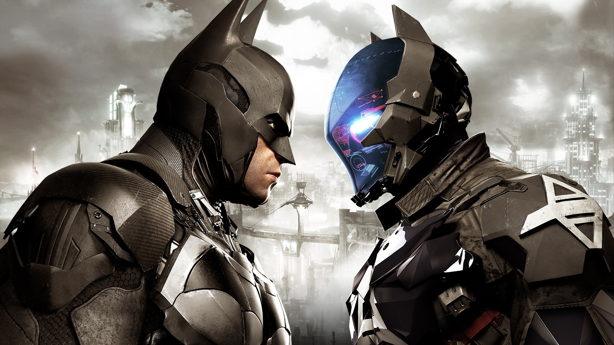

# The Ultimate Batman Fan Quiz

## Tech Stack

This project was made using nodeJS, and was coded on repl.it

## About Project:

This project was made as part of level 0 of neogcamp.

It's a CLI Batman quiz for the most hardcore of fans, in the style of KBC(Kaun Banega Crorepati)!
The user participates in a KBC Style quiz. Each question has multiple answers out of which the correct one must be chosen. Based on the number of questions the user gets correct, they win a corresponding prize amount. Each question has 4 answers, selecting the correct answer, gains you the amount as shown in the prize ladder at the start of the quiz. In case the user selects the wrong answer, the quiz ends, and the user takes home prize money won only up till that point. Regardless of whether or not the user guesses correctly,, the correct answer, along with an explanation is displayed for every question. At the end of the quiz, based on your score, your position in the leaderboard will be shown.

## Live Demo!:

https://user-images.githubusercontent.com/60094625/211813341-a74a9e89-f536-4191-8984-9896fc70b216.mp4

## Project Screens:

